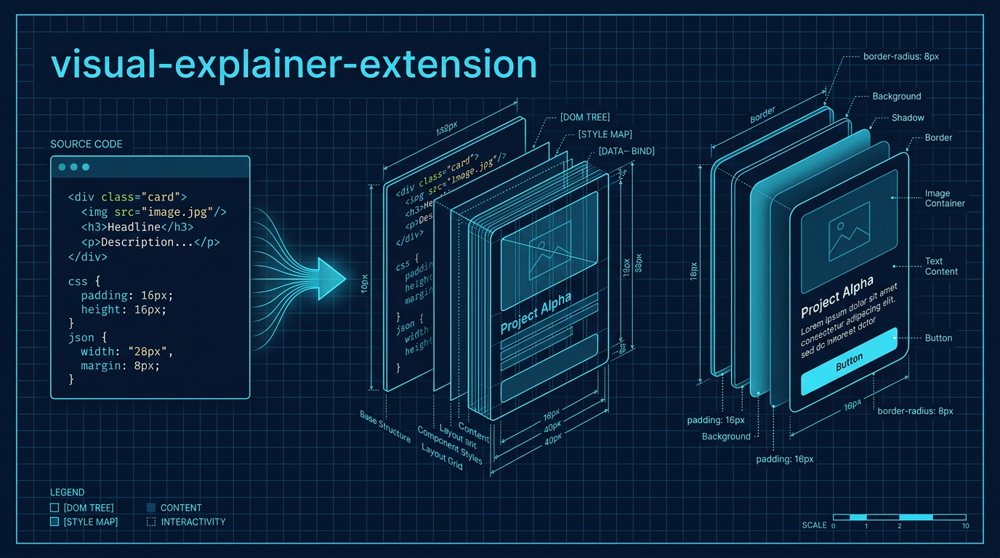

# visual-explainer-extension



**Strikingly well-designed HTML diagrams and reports for the Gemini CLI.**

ABOUTME: `visual-explainer-extension` is a high-fidelity fork of the original `visual-explainer` project. It transforms complex terminal output into sophisticated, human-crafted HTML pages featuring advanced CSS orchestration, premium typography, and native AI image generation.

## Project Overview

This extension replaces generic ASCII art and "AI-slop" templates with interactive HTML pages that follow a strict **Design Engineering Mandate**. It uses modern CSS techniques like `@layer` and `@container` to produce layouts that feel professional, intentional, and high-contrast.

### 🚀 Next-Level Features (v1.0.0+)

- **Advanced CSS Orchestration**: Uses CSS Layers (`@layer`) for robust style management and Container Queries (`@container`) for modular, adaptive components.
- **Premium Typography**: Strictly forbids generic fonts (Inter, Roboto). Employs "High-Character" pairings like *Instrument Serif + JetBrains Mono* and *IBM Plex Sans + Mono*.
- **Aesthetic Recipes**: Built-in high-fidelity modes for **Blueprint**, **Editorial**, and **Paper/Ink** aesthetics.
- **Interactive Components**: 
  - **Intent Bridge**: Maps natural language intent directly to code implementation.
  - **Archetype Cards**: Modular system overviews with AI-generated icons.
  - **Enhanced Code Windows**: IDE-like blocks with file tabs and sophisticated syntax highlighting.
- **Proactive Image Generation**: Automatically generates hero banners, module icons, and background patterns using the built-in Gemini Image tools.
- **Anti-Slop Enforcement**: Hard rules to prevent generic AI patterns (no indigo gradients, no emoji headers, no unstructured code dumps).

## Main Technologies

- **HTML5 / Modern CSS**: Vanilla implementation leveraging CSS Layers and Container Queries.
- **Mermaid.js (ESM)**: For topology-heavy diagrams with `layout: 'elk'` support.
- **Chart.js**: For data-driven dashboards and metric visualizations.
- **Lucide Icons**: Clean, consistent technical icons via SVG.
- **Node.js / MCP**: Native image generation tools using the Gemini API.

## Installation

```bash
# Link the extension to your Gemini CLI
gemini extensions link .
```

## Available Commands

### Visualization Commands
| Command | Description |
|---------|-------------|
| `/diff-review` | Visual diff review with architecture comparison. |
| `/fact-check` | Verify accuracy of a document against code. |
| `/generate-slides` | Generate a magazine-quality slide deck. |
| `/generate-visual-plan` | Generate a visual implementation plan. |
| `/generate-web-diagram` | Generate an HTML diagram for any topic. |
| `/plan-review` | Compare a plan against the codebase. |
| `/project-recap` | Mental model snapshot for context-switching. |
| `/visual-code-explain` | Explain the logic of a code file using Intent Bridges. |
| `/code-archetype` | Generate structural cards for a module or subsystem. |

### Image Generation (Nanobanana Integration)
| Command | Description |
|---------|-------------|
| `/visual-generate` | Generate high-quality images from prompts. |
| `/visual-icon` | Create app icons and UI elements. |
| `/visual-pattern` | Generate seamless, tileable textures. |
| `/visual-story` | Create visually consistent story sequences. |
| `/visual-diagram` | Generate professional diagrams as images. |

## Model Instructions (SKILL.md)

The core logic and design principles are located in `skills/visual-explainer/SKILL.md`. The model follows a **Design Tokens first** workflow, ensuring every output meets the "Squint Test" for visual hierarchy and the "Swap Test" for design intent.

## Development

- **Testing**: Use `gemini extensions link .` to test locally.
- **Portability**: Keep HTML self-contained. All styles and logic are inlined for single-file portability.
- **Performance**: Minimizes turns by reading reference materials in parallel.

---
*Forked from the original `visual-explainer` repository. Re-engineered for aesthetic excellence.*
